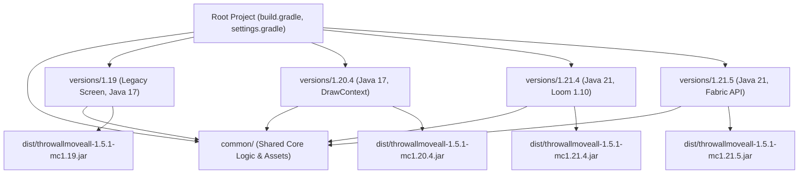
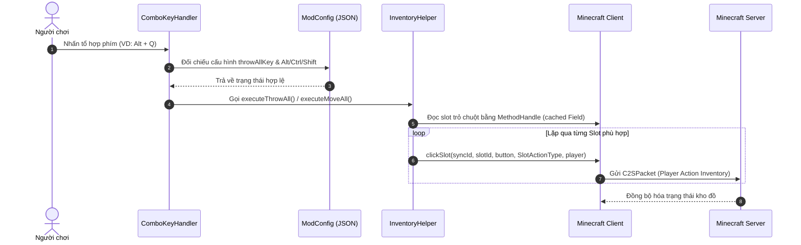
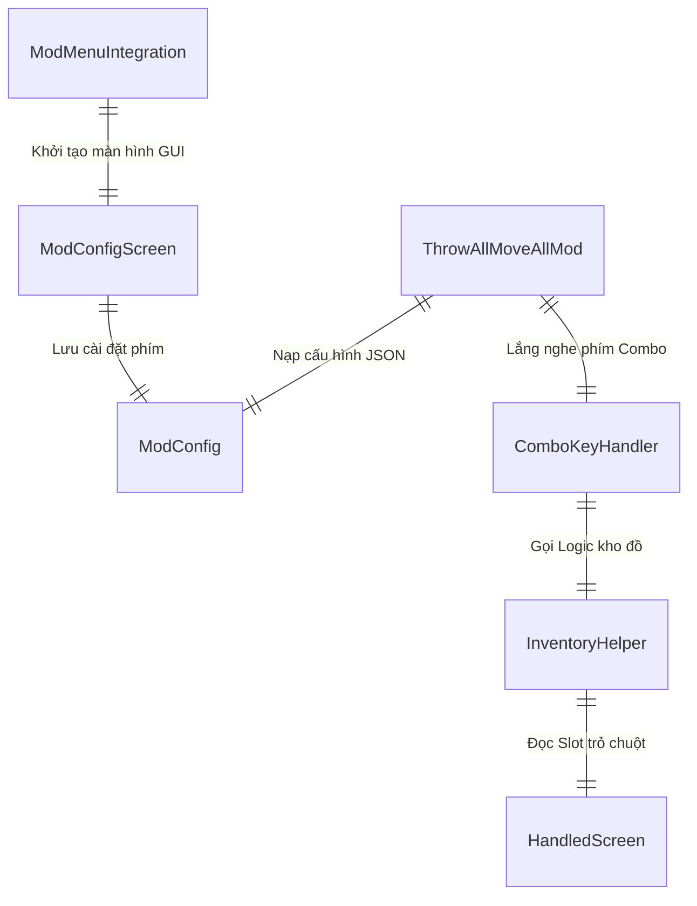

# Kiến trúc Hệ thống Mod ThrowAll & MoveAll (Minecraft 1.19 → 26.2)

Tài liệu này mô tả chi tiết thiết kế kiến trúc, cấu trúc thành phần, luồng xử lý dữ liệu và các sơ đồ kỹ thuật cho dự án ThrowAll & MoveAll Mod theo mô hình **Multi-Project Gradle**.

---

## 1. Tổng quan hệ thống (System Overview)
Mod được thiết kế là một **Client-side Mod** đa phiên bản dành cho Fabric Loader trên Minecraft từ 1.19 đến 26.2 (20 phiên bản chính thức và mở rộng). Mod xử lý các gói tin tương tác kho đồ trực tiếp tại client thông qua `ClientPlayerInteractionManager` nhằm giúp người chơi di chuyển (`MoveAll`) hoặc vứt (`ThrowAll`) toàn bộ vật phẩm trong kho một cách nhanh chóng. Hỗ trợ hệ thống **Config JSON ngoài** (`.minecraft/config/throwallmoveall.json`), phím tắt tổ hợp **Combo Keys** (`Alt + Key`, `Ctrl + Shift + Key`...) và tích hợp giao diện **ModMenu Config GUI**.

---

## 2. Công nghệ sử dụng (Tech Stack)
- **Ngôn ngữ lập trình:** Java 17 (Era 1: 1.19-1.20.4), Java 21 (Era 2: 1.20.5-1.21.11), Java 25 (Era 3: 26.1-26.2).
- **Build System:** Gradle Multi-Project (`settings.gradle` include `common` & 20 subproject `:versions:<ver>`).
- **Modding Framework:** Fabric Loader & Fabric API tương ứng từng phiên bản Minecraft.
- **Mapping:** Fabric Yarn Mappings (1.19 → 1.21.11), Mojang Official Mappings Unobfuscated (26.1 → 26.2).
- **Thư viện đồ họa & Input:** Lightweight Java Game Library (LWJGL3 / GLFW).
- **Cấu hình & Dữ liệu:** Google Gson (Tệp cấu hình JSON).
- **Tích hợp:** Mod Menu API.

---

## 3. Cấu trúc thư mục (Folder Structure)
```
throwallmoveall/
├── settings.gradle                           # Khai báo bao gồm 20 subproject versions
├── build.gradle                              # File cấu hình tổng (Root Task buildAll & collectJars)
├── README.md                                 # Hướng dẫn sử dụng & cài đặt bằng Tiếng Việt
├── dist/                                     # Thư mục tổng hợp các file .jar đầu ra (20 files)
├── docs/
│   ├── architecture.md                       # Tài liệu kiến trúc hệ thống
│   └── CHANGELOG.md                          # Nhật ký thay đổi phiên bản
├── common/                                   # Mã nguồn & tài nguyên chung (1.20.6 → 1.21.5)
│   └── src/main/
│       ├── java/com/example/throwallmoveall/ # Logic core hiện đại (Data Components)
│       └── resources/assets/                 # Assets ngôn ngữ và icon
├── common-nbt/                               # Mã nguồn chung dành riêng cho NBT Era (1.19 → 1.20.2)
│   └── src/main/java/                        # InventoryHelper tương thích NBT Compound
└── versions/                                 # Subprojects cấu hình riêng cho từng MC version
    ├── 1.19/ .. 1.20.2/                      # Kết hợp common/ và common-nbt/
    ├── 1.20.4/                               # Mã nguồn riêng (fix ném đồ Creative Mode & NBT)
    ├── 1.20.6/ .. 1.21.5/                    # Kế thừa common/ (Data Components)
    ├── 1.21.6/ .. 1.21.8/                    # Mã nguồn riêng (fix renderBackground blur)
    ├── 1.21.9/ .. 1.21.11/                   # Mã nguồn riêng (API Click/KeyInput mới)
    ├── 26.1/                                 # Mã nguồn riêng Mojang Mappings (Java 25)
    └── 26.2/                                 # Mã nguồn riêng Mojang Mappings (26.2 GUI)
```

---

## 4. Kiến trúc thành phần (Component Architecture)
- **Common Module (`common/`):** Chứa toàn bộ core business logic không phụ thuộc phiên bản (`ComboKeyHandler`, `ScreenMouseHandler`, `ModConfig`, `KeyBindings`) và bản `InventoryHelper` chuẩn Data Components cho Minecraft 1.20.6+.
- **Common NBT Module (`common-nbt/`):** Chứa bản `InventoryHelper` chuẩn NBT Compound cho các phiên bản Minecraft 1.19 đến 1.20.2.
- **Client EntryPoint Layer (`ThrowAllMoveAllMod`):** Khởi tạo tệp cấu hình JSON ngoài và đăng ký sự kiện `ClientTickEvents.END_CLIENT_TICK`.
- **Config Management Layer (`ModConfig`):** Đọc/ghi cài đặt phím tắt tổ hợp Combo và 2 tùy chọn so khớp thông minh (`matchComponents`, `ignoreDurability`) tại `.minecraft/config/throwallmoveall.json`.
- **Combo Key Handler Layer (`ComboKeyHandler` & `ScreenMouseHandler`):** Đọc trạng thái GLFW phím chính và các phím Modifier (`Alt`, `Ctrl`, `Shift`) ở mức thấp.
- **Config GUI Layer (`ModConfigScreen` & `ModMenuIntegration`):** Cung cấp giao diện bấm nút tùy chỉnh phím tắt In-Game. Bản legacy (1.19.x) dùng `MatrixStack`, bản modern (1.20+) dùng `DrawContext`.
- **Smart Inventory Matching Layer (`InventoryHelper`):** 
  - Truy vấn `Slot` đang được trỏ chuột bằng Reflection (có caching `MethodHandle`).
  - Sao chép bản sao độc lập `targetStack = focused.getStack().copy()` (hoặc `focused.getItem().copy()` trên 26.x) để ngăn chặn việc biến đổi dữ liệu tham chiếu khi ô trỏ chuột bị dọn sạch.
  - Thực hiện thuật toán so khớp đa thế hệ `isMatching(ItemStack current, ItemStack target)`:
    - So khớp theo Loại vật phẩm gốc (`isOf`/`is`) kết hợp Tên hiển thị (`getName().getString()` / `getHoverName().getString()`). Phân biệt chuẩn xác vật phẩm tùy chỉnh plugin (Custom Items) mà không bị xung đột với các dữ liệu ngầm (UUID chống dupe, timestamp...).
    - Xử lý ngoại lệ đối với Sách bùa phép (`Items.ENCHANTED_BOOK`): So khớp sâu bùa chú (NBT / Components).
    - Xử lý thông minh hao mòn độ bền (`ignoreDurability`), cho phép dọn các công cụ/vũ khí cùng loại bị sứt mẻ độ bền khác nhau mà không làm ảnh hưởng tới đồ bùa phép hoặc đồ Custom.

---

## 5. Luồng dữ liệu (Data Flow)
1. `ThrowAllMoveAllMod` nạp cài đặt từ `.minecraft/config/throwallmoveall.json` thông qua `ModConfig.load()`.
2. Trong mỗi Client Tick, `ComboKeyHandler` đọc trạng thái phím GLFW thấp và kiểm tra xem phím tổ hợp (VD: `Alt + Q` hoặc `Alt + Chuột trái`) có được nhấn hay không.
3. Khi phím tổ hợp hợp lệ được bấm, `InventoryHelper` kiểm tra `client.currentScreen`:
   - Xác định `Slot` được trỏ chuột bằng Reflection (`MethodHandle` cached field).
   - Tạo bản sao an toàn của vật phẩm mục tiêu: `targetStack = focused.getStack().copy()` (trên 26.x: `focused.getItem().copy()`).
   - Duyệt qua từng slot trong kho đồ và kiểm tra tính hợp lệ bằng thuật toán `isMatching(slotStack, targetStack)`.
4. Gửi gói tin tương tác `clickSlot` với loại thao tác tương ứng (`QUICK_MOVE` hoặc `THROW`) tới Server.

---

## 6. Cơ chế bảo mật (Security Mechanisms)
- Tệp cấu hình JSON được lưu trữ an toàn trong thư mục chuẩn `config/` của Minecraft client.
- Bắt sự kiện bàn phím mức thấp nhưng tuân thủ nguyên tắc khóa phím khi không ở giao diện kho đồ thích hợp.

---

## 7. APIs / Routes cốt lõi (Core APIs/Routes)
- `ModConfig.load()` / `ModConfig.save()`: API quản lý tệp cấu hình JSON ngoài.
- `InputUtil.isKeyPressed(windowHandle, keyCode)`: API kiểm tra trạng thái phím GLFW.
- `ClientTickEvents.END_CLIENT_TICK.register(...)`: Vòng lặp lắng nghe client tick.
- `ModMenuApi.getModConfigScreenFactory()`: API đăng ký màn hình Cài đặt trong Mod Menu.

---

## 8. Sơ đồ trực quan (Visual Diagrams - Mermaid.js)

### Sơ đồ Luồng Kiến trúc Multi-Project (Flowchart)


### Sơ đồ Trình tự Thao tác Inventory (Sequence Diagram)


### Sơ đồ Mối quan hệ Thành phần (Component Relationship Diagram)

