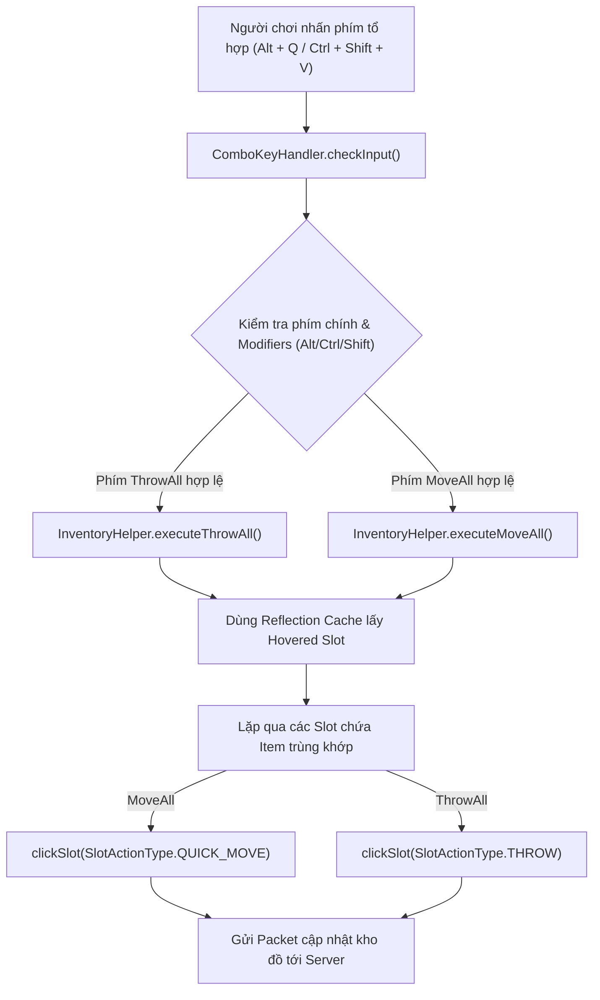
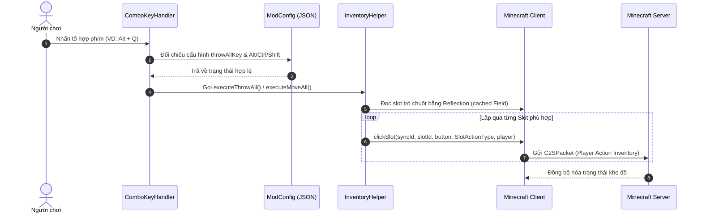
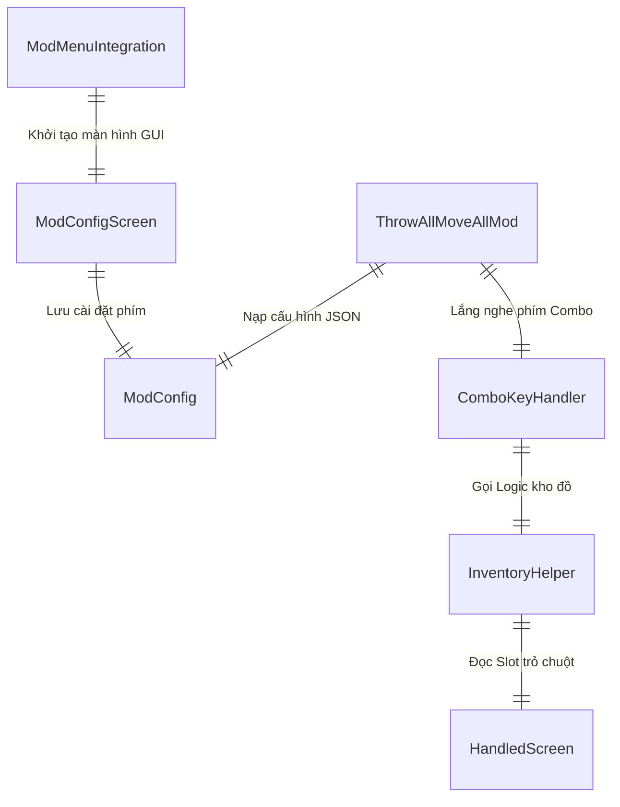

# Kiến trúc Hệ thống Mod ThrowAll & MoveAll (Minecraft 1.20.4)

Tài liệu này mô tả chi tiết thiết kế kiến trúc, cấu trúc thành phần, luồng xử lý dữ liệu và các sơ đồ kỹ thuật cho dự án ThrowAll & MoveAll Mod.

---

## 1. Tổng quan hệ thống (System Overview)
Mod được thiết kế là một **Client-side Mod** dành cho Fabric Loader trên Minecraft 1.20.4. Mod xử lý các gói tin tương tác kho đồ trực tiếp tại client thông qua `ClientPlayerInteractionManager` nhằm giúp người chơi di chuyển (`MoveAll`) hoặc vứt (`ThrowAll`) toàn bộ vật phẩm trong kho một cách nhanh chóng. Hỗ trợ hệ thống **Config JSON ngoài** (`.minecraft/config/throwallmoveall.json`), phím tắt tổ hợp **Combo Keys** (`Alt + Key`, `Ctrl + Shift + Key`...) và tích hợp giao diện **ModMenu Config GUI**.

---

## 2. Công nghệ sử dụng (Tech Stack)
- **Ngôn ngữ lập trình:** Java 17.
- **Build System:** Maven (`pom.xml`) & Gradle (`build.gradle` với Fabric Loom).
- **Modding Framework:** Fabric Loader (`0.15.7`), Fabric API (`0.97.0+1.20.4`).
- **Mapping:** Yarn Mappings cho Minecraft 1.20.4.
- **Thư viện đồ họa & Input:** Lightweight Java Game Library (LWJGL3 / GLFW).
- **Cấu hình & Dữ liệu:** Google Gson (Tệp cấu hình JSON).
- **Tích hợp:** Mod Menu API (`9.0.0`).

---

## 3. Cấu trúc thư mục (Folder Structure)
```
d:/CodeJava/ModMinecraft/ThowAllMoveAll/
├── pom.xml                                   # Cấu hình dự án theo chuẩn Maven POM
├── build.gradle                              # Cấu hình phụ trợ cho Fabric Loom Toolchain
├── gradle.properties                         # Khai báo phiên bản Minecraft & Fabric Dependencies
├── settings.gradle                           # Cấu hình Gradle Root Project
├── README.md                                 # Hướng dẫn sử dụng & cài đặt bằng Tiếng Việt
├── docs/
│   ├── architecture.md                       # Tài liệu kiến trúc hệ thống
│   └── CHANGELOG.md                          # Nhật ký thay đổi phiên bản
└── src/
    └── main/
        ├── java/
        │   └── com/
        │       └── example/
        │           └── throwallmoveall/
        │               ├── ThrowAllMoveAllMod.java    # Client Mod EntryPoint
        │               ├── config/
        │               │   └── ModConfig.java         # Quản lý đọc/ghi config.json ngoài
        │               └── client/
        │                   ├── ComboKeyHandler.java   # Xử lý bắt phím tổ hợp Combo (Alt/Ctrl/Shift)
        │                   ├── ModConfigScreen.java   # Giao diện cài đặt GUI In-Game
        │                   ├── ModMenuIntegration.java# Tích hợp nút Configure vào Mod Menu
        │                   └── InventoryHelper.java   # Logic tương tác kho đồ Client (Reflection Caching)
        └── resources/
            ├── fabric.mod.json              # Metadata cho Fabric Mod Loader
            └── assets/
                └── throwallmoveall/
                    └── lang/                # Tệp dịch ngôn ngữ (en_us.json, vi_vn.json)
```

---

## 4. Kiến trúc thành phần (Component Architecture)
- **Client EntryPoint Layer (`ThrowAllMoveAllMod`):** Khởi tạo tệp cấu hình JSON ngoài và đăng ký sự kiện `ClientTickEvents.END_CLIENT_TICK`.
- **Config Management Layer (`ModConfig`):** Đọc/ghi cài đặt phím tắt tổ hợp Combo tại `.minecraft/config/throwallmoveall.json`.
- **Combo Key Handler Layer (`ComboKeyHandler`):** Đọc trạng thái GLFW phím chính và các phím Modifier (`Alt`, `Ctrl`, `Shift`) ở mức thấp.
- **Config GUI Layer (`ModConfigScreen` & `ModMenuIntegration`):** Cung cấp giao diện bấm nút tùy chỉnh phím tắt In-Game và tích hợp Mod Menu API.
- **Inventory Handler Layer (`InventoryHelper`):** Truy vấn ô kho đồ đang được trỏ chuột bằng Reflection (có caching), áp bộ lọc an toàn và phát lệnh click slot qua `ClientPlayerInteractionManager`.

---

## 5. Luồng dữ liệu (Data Flow)
1. `ThrowAllMoveAllMod` nạp cài đặt từ `.minecraft/config/throwallmoveall.json` thông qua `ModConfig.load()`.
2. Trong mỗi Client Tick, `ComboKeyHandler` đọc trạng thái phím GLFW thấp và kiểm tra xem phím tổ hợp (VD: `Alt + Q` hoặc `Ctrl + Shift + V`) có được nhấn hay không.
3. Khi phím tổ hợp hợp lệ được bấm, `InventoryHelper` kiểm tra `client.currentScreen`:
   - Xác định `Slot` được trỏ chuột bằng Reflection (Cache Field).
   - Duyệt danh sách các `Slot` phù hợp trong kho đồ.
4. Gửi gói tin tương tác `clickSlot` với loại thao tác tương ứng (`QUICK_MOVE` hoặc `THROW`) tới Server.

---

## 6. Cơ chế bảo mật (Security Mechanisms)
- Tệp cấu hình JSON được lưu trữ an toàn trong thư mục chuẩn `config/` của Minecraft client.
- Bắt sự kiện bàn phím mức thấp nhưng tuân thủ nguyên tắc khóa phím khi không ở giao diện kho đồ thích hợp.

---

## 7. APIs / Routes cốt lõi (Core APIs/Routes)
- `ModConfig.load()` / `ModConfig.save()`: API quản lý tệp cấu hình JSON ngoài.
- `InputUtil.isKeyPressed(windowHandle, keyCode)`: API kiểm tra trạng thái phím GLFW.
- `ClientTickEvents.END_CLIENT_TICK.register(...)`: Vòng lặp lắng nghe client tick.
- `ModMenuApi.getModConfigScreenFactory()`: API đăng ký màn hình Cài đặt trong Mod Menu.

---

## 8. Sơ đồ trực quan (Visual Diagrams - Mermaid.js)

### Sơ đồ Luồng Kiến trúc Hệ thống (Flowchart)


### Sơ đồ Trình tự Thao tác (Sequence Diagram)


### Sơ đồ Mối quan hệ Thành phần (Component Relationship Diagram)

