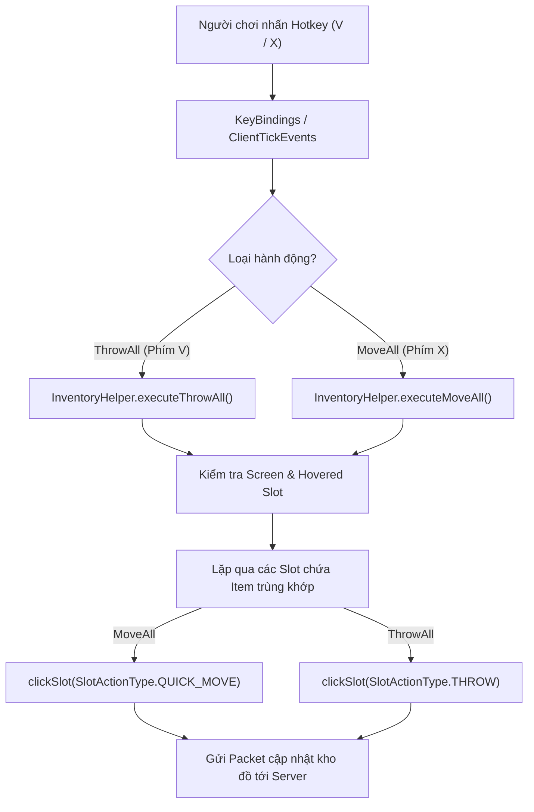
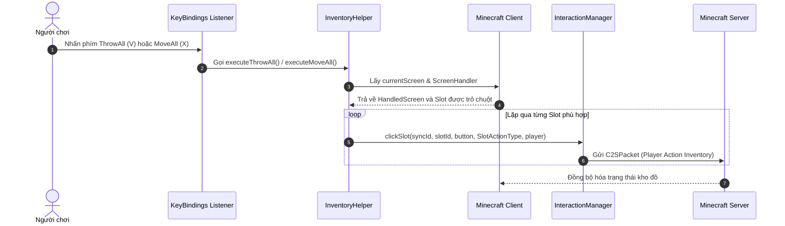
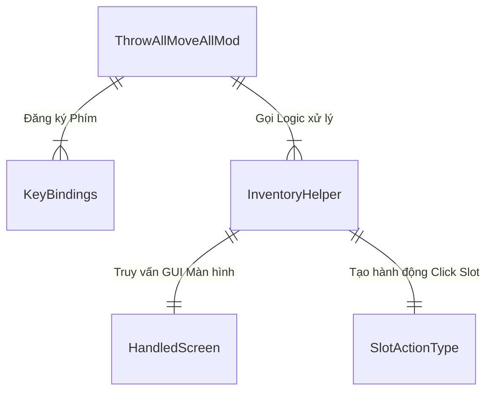

# Kiến trúc Hệ thống Mod ThrowAll & MoveAll (Minecraft 1.20.4)

Tài liệu này mô tả chi tiết thiết kế kiến trúc, cấu trúc thành phần, luồng xử lý dữ liệu và các sơ đồ kỹ thuật cho dự án ThrowAll & MoveAll Mod.

---

## 1. Tổng quan hệ thống (System Overview)
Mod được thiết kế là một **Client-side Mod** dành cho Fabric Loader trên Minecraft 1.20.4. Mod xử lý các gói tin tương tác kho đồ trực tiếp tại client thông qua `ClientPlayerInteractionManager` nhằm giúp người chơi di chuyển (`MoveAll`) hoặc vứt (`ThrowAll`) toàn bộ vật phẩm trong kho một cách nhanh chóng và tối ưu hiệu năng.

---

## 2. Công nghệ sử dụng (Tech Stack)
- **Ngôn ngữ lập trình:** Java 17.
- **Build System:** Maven (`pom.xml`) & Gradle (`build.gradle` với Fabric Loom).
- **Modding Framework:** Fabric Loader (`0.15.7`), Fabric API (`0.97.0+1.20.4`).
- **Mapping:** Yarn Mappings cho Minecraft 1.20.4.
- **Thư viện đồ họa & Input:** Lightweight Java Game Library (LWJGL3 / GLFW).

---

## 3. Cấu trúc thư mục (Folder Structure)
```
d:/CodeJava/ModMinecraft/ThowAllMoveAll/
├── pom.xml                                   # Cấu hình dự án theo chuẩn Maven POM
├── build.gradle                              # Cấu hình phụ trợ cho Fabric Loom Toolchain
├── gradle.properties                         # Khai báo phiên bản Minecraft & Fabric Dependencies
├── settings.gradle                           # Cấu hình Gradle Root Project
├── README.md                                 # Hướng dẫn sử dụng & cài đặt bằng Tiếng Việt
├── docs/
│   ├── architecture.md                       # Tài liệu kiến trúc hệ thống
│   └── CHANGELOG.md                          # Nhật ký thay đổi phiên bản
└── src/
    └── main/
        ├── java/
        │   └── com/
        │       └── example/
        │           └── throwallmoveall/
        │               ├── ThrowAllMoveAllMod.java    # Client Mod EntryPoint
        │               ├── mixin/
        │               │   └── HandledScreenAccessor.java # Mixin Accessor tối ưu hiệu năng lấy Slot
        │               └── client/
        │                   ├── KeyBindings.java       # Quản lý & Đăng ký Hotkeys
        │                   └── InventoryHelper.java   # Logic tương tác kho đồ Client
        └── resources/
            ├── fabric.mod.json              # Metadata cho Fabric Mod Loader
            └── throwallmoveall.mixins.json  # Cấu hình Fabric Mixins
```

---

## 4. Kiến trúc thành phần (Component Architecture)
- **Client EntryPoint Layer (`ThrowAllMoveAllMod`):** Khởi tạo mod khi game nạp client, đăng ký phím tắt và bắt sự kiện tick người chơi (`ClientTickEvents`).
- **KeyBinding Registry Layer (`KeyBindings`):** Khai báo và lưu trữ 2 phím tắt chính (`ThrowAll` phím `V`, `MoveAll` phím `X`) trong kho keybinds của Minecraft.
- **Mixin Accessor Layer (`HandledScreenAccessor`):** Giao diện Mixin giúp đọc thuộc tính `focusedSlot` trên GUI màn hình với hiệu năng tối đa (không sử dụng Reflection).
- **Inventory Handler Layer (`InventoryHelper`):** Thành phần xử lý chính thực hiện truy vấn giao diện GUI màn hình (`HandledScreen`), áp dụng bộ lọc an toàn và phát lệnh click slot qua `ClientPlayerInteractionManager`.

---

## 5. Luồng dữ liệu (Data Flow)
1. Người chơi nhấn hotkey trong game (`V` cho ThrowAll hoặc `X` cho MoveAll).
2. `ClientTickEvents.END_CLIENT_TICK` phát hiện sự kiện phím tắt được kích hoạt.
3. `ThrowAllMoveAllMod` chuyển giao lệnh xử lý tới `InventoryHelper`.
4. `InventoryHelper` kiểm tra giao diện GUI hiện tại (`client.currentScreen`):
   - Nếu là `HandledScreen`: Lấy `ScreenHandler`, xác định `Slot` được con trỏ chuột trỏ vào.
   - Duyệt danh sách các `Slot` phù hợp trong kho đồ.
5. Gửi gói tin tương tác `clickSlot` với loại thao tác tương ứng (`SlotActionType.QUICK_MOVE` hoặc `SlotActionType.THROW`) tới Server.

---

## 6. Cơ chế bảo mật (Security Mechanisms)
- Mod hoàn toàn chạy ở môi trường **Client-side**, tuân thủ nghiêm ngặt giao thức mạng mặc định của Minecraft Protocol (Container Click Packets).
- Không can thiệp hoặc thay đổi dữ liệu Server-side độc hại, tránh bị hệ thống Anti-Cheat coi là Packet Spam bằng cách gửi sự kiện click theo đúng thứ tự slot hợp lệ.

---

## 7. APIs / Routes cốt lõi (Core APIs/Routes)
- `ClientModInitializer.onInitializeClient()`: API khởi tạo Client Mod.
- `KeyBindingHelper.registerKeyBinding(KeyBinding)`: Đăng ký phím bấm mới vào cấu hình Game.
- `ClientTickEvents.END_CLIENT_TICK.register(ClientTick)`: Lắng nghe vòng lặp tick client.
- `ClientPlayerInteractionManager.clickSlot(syncId, slotId, button, actionType, player)`: Thực hiện tương tác với ô kho đồ.

---

## 8. Sơ đồ trực quan (Visual Diagrams - Mermaid.js)

### Sơ đồ Luồng Kiến trúc Hệ thống (Flowchart)


### Sơ đồ Trình tự Thao tác (Sequence Diagram)


### Sơ đồ Mối quan hệ Thành phần (Component Relationship Diagram)

